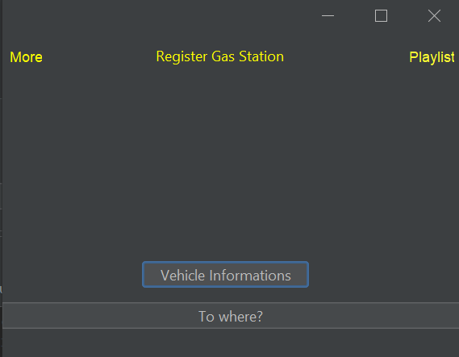
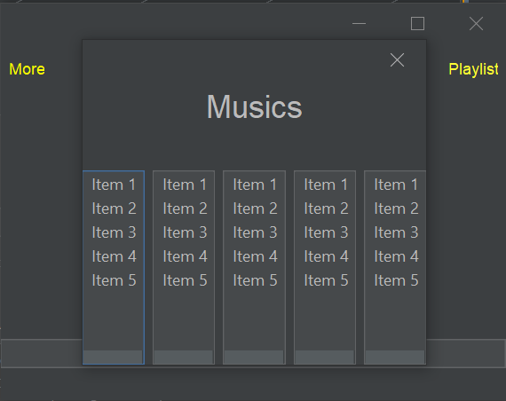
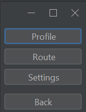

# Abastecendo_Informacoes

MEMBROS DO GRUPO: Ezequiel Gaviraghi, Gabriel Hepper Borges Garcia, João Vítor Silva dos Santos, Paulo Willian Joner Cassel, Yan Müller

You will be able to Log In.

 If you don't have an account, you'll be able to create one.

you can choose a rout, listen to music, you also can change the settings of the app.
                     

You can check your vehicles, you also can change and register a vehicle.
                                 

Everyone likes to listen to music while driving, rigth?
                         

You will be able to check and change your profile. You can define a fixed rout, and you also can change your settings.
                     

CadastrarPosto - Here, who is managing the app will have permission to register gas stations.
